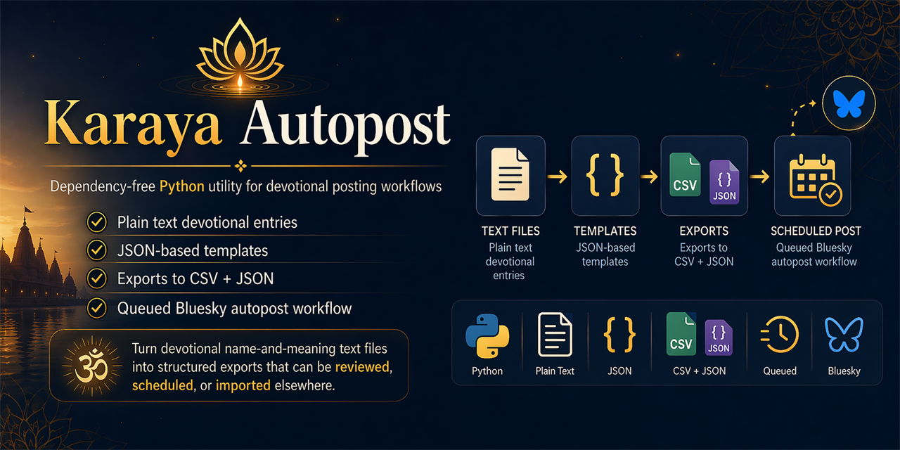

# Karaya Autopost



Karaya Autopost is a small, dependency-free Python utility for turning devotional name-and-meaning text files into template-based CSV and JSON exports.

It was built for simple devotional posting workflows: keep source entries in plain text, choose a text template in JSON, and generate structured exports that can be reviewed, scheduled, or imported elsewhere.

The repo also includes Bluesky and Tumblr autopost workflows that publish one queued text post at a time on a schedule.

See this tool in action:
[kaliputraashish.bsky.social](https://bsky.app/profile/kaliputraashish.bsky.social)

## Features

- Parses plain `name: meaning` source files.
- Accepts numbered source lists such as `1. Kali: The Black Goddess`.
- Renders post text from a configurable template.
- Exports matching CSV and JSON records.
- Flags records that exceed a configurable character limit.
- Posts one queued text record at a time to Bluesky.
- Posts one queued text record at a time to Tumblr.
- Uses only the Python standard library at runtime.

## How It Works

1. Source text files are parsed into structured devotional entries.
2. A JSON config applies a reusable `post_template` to each entry.
3. The generator writes a queue file under `output/`.
4. GitHub Actions reads that queue and posts the next unposted record to Bluesky or Tumblr.
5. Each workflow commits its state file back to the repo so posting resumes in order.

## Repository Contents

- `generate_posts.py` - command-line generator and parsing/export helpers.
- `post_next_bluesky.py` - posts exactly one next Bluesky record from a generated JSON queue.
- `post_next_tumblr.py` - posts exactly one next Tumblr record from a generated JSON queue.
- `tumblr_oauth_helper.py` - prints the Tumblr authorization URL and exchanges a one-time code for a refresh token.
- `post_config.json` - Kalabhairava export configuration.
- `post_config_mahakali.json` - Mahakali export configuration.
- `.github/workflows/bluesky-autopost.yml` - every-30-minutes Bluesky workflow.
- `.github/workflows/tumblr-autopost.yml` - every-30-minutes Tumblr workflow.
- `output/bluesky_post_state.json` - persistent Bluesky posting state committed back to the repo.
- `output/tumblr_post_state.json` - persistent Tumblr posting state committed back to the repo.
- `combined_kalabhairava_onelinemeanings_nosalutations_FULL_APRIL22.txt` - Kalabhairava source entries.
- `combined_mahakali_onelinemeanings__FULL_APRIL22.txt` - Mahakali source entries.
- `requirements-dev.txt` - development-only test dependency list.
- `tests/test_generate_posts.py` - pytest coverage for config loading, parsing, rendering, and file exports.
- `tests/test_post_next_bluesky.py` - pytest coverage for queue progression and Bluesky state handling.
- `tests/test_post_next_tumblr.py` - pytest coverage for queue progression, tag extraction, and Tumblr state handling.

## Requirements

- Python 3.10 or newer.
- `pytest` only if you want to run the test suite.

The generator itself uses only the Python standard library.

## Quick Start

Run commands from the repository root:

```bash
python generate_posts.py --config post_config.json
python generate_posts.py --config post_config_mahakali.json
```

By default, these write files under `output/`:

- `output/generated_posts.csv`
- `output/generated_posts.json`
- `output/generated_posts_mahakali.csv`
- `output/generated_posts_mahakali.json`

The script prints the number of generated records, output paths, how many entries exceed the configured length limit, and how many malformed source lines were skipped.

## Tracked Output Files

Most generated exports are ignored by git, but these files are intentionally tracked:

- `output/generated_posts.json` - the queue consumed by GitHub Actions
- `output/generated_posts_mahakali.json` - the Mahakali queue consumed by Tumblr GitHub Actions
- `output/bluesky_post_state.json` - the posting state used to resume in order
- `output/tumblr_post_state.json` - the Tumblr posting state used to resume in order

This makes the bot easy to audit and recover without an external database.

## Bluesky Autopost

This repo includes a production Bluesky autopost flow:

- queue source: `output/generated_posts.json`
- state file: `output/bluesky_post_state.json`
- schedule: every 30 minutes at minutes `17` and `47`
- posting order: first to last, no randomness
- posting mode: one text post per run

### Required GitHub Repository Secrets

Add these in `Settings -> Secrets and variables -> Actions`:

- `BLUESKY_IDENTIFIER`
- `BLUESKY_APP_PASSWORD`

Optional environment variable:

- `BLUESKY_PDS_HOST`
  Default: `https://bsky.social`

### Workflow Behavior

Workflow file: `.github/workflows/bluesky-autopost.yml`

- Runs on cron `17,47 * * * *` and supports manual `workflow_dispatch`.
- Uses workflow concurrency group `bluesky-autopost` to prevent overlapping posts.
- Runs only from the `main` branch.
- Calls:

```bash
python post_next_bluesky.py --json output/generated_posts.json --state output/bluesky_post_state.json
```

- Commits `output/bluesky_post_state.json` back to the repo only when state changes.

## Tumblr Autopost

This repo includes a production Tumblr autopost flow:

- queue source: `output/generated_posts_mahakali.json`
- state file: `output/tumblr_post_state.json`
- schedule: every 30 minutes at minutes `17` and `47`
- posting order: first to last, no randomness
- posting mode: one published text post per run
- tag behavior: hashtags from `post_text` are also extracted into Tumblr tags

### Required GitHub Repository Secrets

Add these in `Settings -> Secrets and variables -> Actions`:

- `TUMBLR_CLIENT_ID`
- `TUMBLR_CLIENT_SECRET`
- `TUMBLR_REFRESH_TOKEN`
- `TUMBLR_BLOG_IDENTIFIER`

Optional environment variable:

- `TUMBLR_API_BASE`
  Default: `https://api.tumblr.com`

### Workflow Behavior

Workflow file: `.github/workflows/tumblr-autopost.yml`

- Runs on cron `17,47 * * * *` and supports manual `workflow_dispatch`.
- Uses workflow concurrency group `tumblr-autopost` to prevent overlapping posts.
- Runs only from the `main` branch.
- Calls:

```bash
python post_next_tumblr.py --json output/generated_posts_mahakali.json --state output/tumblr_post_state.json
```

- Commits `output/tumblr_post_state.json` back to the repo only when state changes.

### One-Time Tumblr OAuth Setup

Create a Tumblr OAuth application and set a valid redirect URI on it. Then:

```bash
set TUMBLR_CLIENT_ID=your_client_id
set TUMBLR_CLIENT_SECRET=your_client_secret
set TUMBLR_REDIRECT_URI=https://your-registered-redirect.example/callback
python tumblr_oauth_helper.py authorize
```

Open the printed authorization URL, approve the app, and copy the `code` query parameter from the redirect URL. Then exchange it:

```bash
python tumblr_oauth_helper.py exchange --code YOUR_CODE
```

Store the returned refresh token in GitHub Actions as `TUMBLR_REFRESH_TOKEN`, and set `TUMBLR_BLOG_IDENTIFIER` to `kakakaforadyakali.tumblr.com`.

### Manual Run

You can trigger the workflow manually from the GitHub Actions tab:

1. Open the repository on GitHub
2. Go to `Actions`
3. Open `Bluesky Autopost`
4. Click `Run workflow`

This is useful for testing credentials or pushing the next queued post immediately.

### Revoking Access

This project is designed to use a Bluesky app password rather than your main account password.

If you ever want to cut off access:

1. Open Bluesky settings
2. Go to `App Passwords`
3. Revoke the app password used by this repo
4. Generate a new one and update `BLUESKY_APP_PASSWORD` in GitHub if needed

## Install for Development

```bash
python -m venv .venv
.venv\Scripts\activate
python -m pip install -r requirements-dev.txt
```

On macOS or Linux, activate the virtual environment with:

```bash
source .venv/bin/activate
```

## Source File Format

Each valid source entry must contain a name and meaning separated by the first colon:

```text
Bhairavaaya: The one who is terrifying and who destroys fear.
```

Numbered lines are also accepted:

```text
1. Kali: The Black Goddess, ruler of Time.
```

Blank lines are ignored. Non-blank lines without a valid `name: meaning` shape are skipped and counted in the command output.

## Configuration

Each config file is JSON with these fields:

```json
{
  "input_file": "combined_kalabhairava_onelinemeanings_nosalutations_FULL_APRIL22.txt",
  "post_template": "Today's name is {name}. {meaning} Jai Bhairava.",
  "csv_output": "output/generated_posts.csv",
  "json_output": "output/generated_posts.json",
  "max_length": 300
}
```

Required fields:

- `input_file` - source text file to parse.
- `post_template` - Python format string used to render each post.
- `csv_output` - CSV export path.
- `json_output` - JSON export path.

Optional fields:

- `max_length` - character limit used for the `fits_length_limit` flag. Defaults to `300`.

Paths may be absolute or relative. Relative paths are resolved from the config file's directory.

Available template fields:

- `{index}` - 1-based entry number after skipped lines are removed.
- `{name}` - parsed devotional name.
- `{meaning}` - parsed one-line meaning.

## Output Schema

CSV and JSON records include:

- `index`
- `name`
- `meaning`
- `post_text`
- `character_count`
- `fits_length_limit`
- `source_file`

## Run Tests

```bash
python -m pytest -v
```

Current test coverage verifies path resolution, accepted input formats, malformed-line handling, template rendering, length-limit flags, CSV/JSON file creation, queue progression, and publisher state updates for Bluesky and Tumblr.

## Public Release Notes

- Most generated exports are ignored by git. The tracked queue/state files under `output/` are kept for automation.
- The included devotional source files are part of the project data. Before publishing or redistributing modified datasets, confirm that any added content can be shared publicly.
- Bluesky posting requires `BLUESKY_IDENTIFIER` and `BLUESKY_APP_PASSWORD`.
- Tumblr posting requires `TUMBLR_CLIENT_ID`, `TUMBLR_CLIENT_SECRET`, `TUMBLR_REFRESH_TOKEN`, and `TUMBLR_BLOG_IDENTIFIER`.

## Public Repo Safety

- GitHub Actions secrets are not stored in the repository contents.
- Use a Bluesky app password, not your main account password.
- Use a Tumblr OAuth refresh token rather than storing your Tumblr password anywhere in the repo.
- Do not add PR-triggered workflows that consume secrets.
- Keep write access to the repo restricted.
- If anything suspicious happens, revoke the Bluesky app password immediately.
- `BLUESKY_PDS_HOST` must be an `https://` host root, not a full endpoint URL.
- If anything suspicious happens, revoke the Tumblr app authorization and rotate the refresh token.
- `TUMBLR_API_BASE` must be an `https://` host root, not a full endpoint URL.

## Roadmap

- Add Nostr integration for open-protocol text publishing.
- Keep the queue format generic so more platforms can be added without changing source data.

## Contributing

See [CONTRIBUTING.md](CONTRIBUTING.md) for local setup and pull request guidelines.

## License

This project is released under the MIT License. See [LICENSE](LICENSE).
